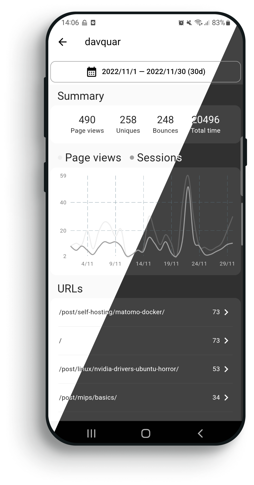

# HalfDot for Umami

HalfDot is a minimalistic **FOSS Android client for [Umami](https://github.com/umami-software/umami)**: an open-source and privacy-focused web analytics platform.

HalfDot is:

* Free.
* Open source.
* Without tracking.
* Without ads.
* Material Design 3.

## Contributing

Any contribution is welcome :)

### Authors

* [Davide Quaranta](https://github.com/davquar)
* You?

## Disclaimer

* I'm not affiliated with Umami Software.
* I built this app to learn Flutter and Dart: something may not be idiomatic/best.
